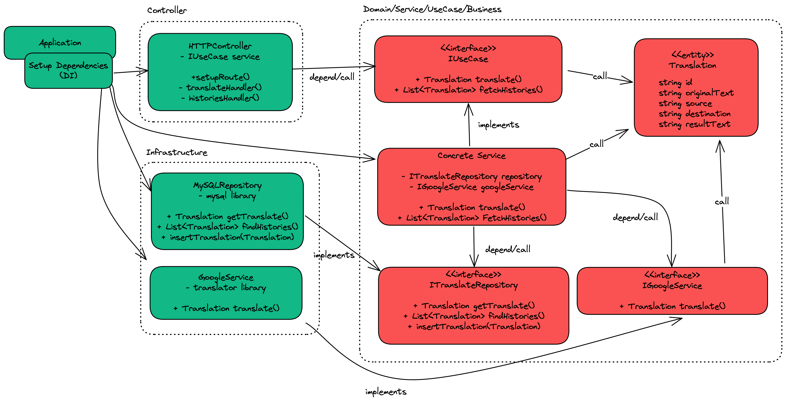
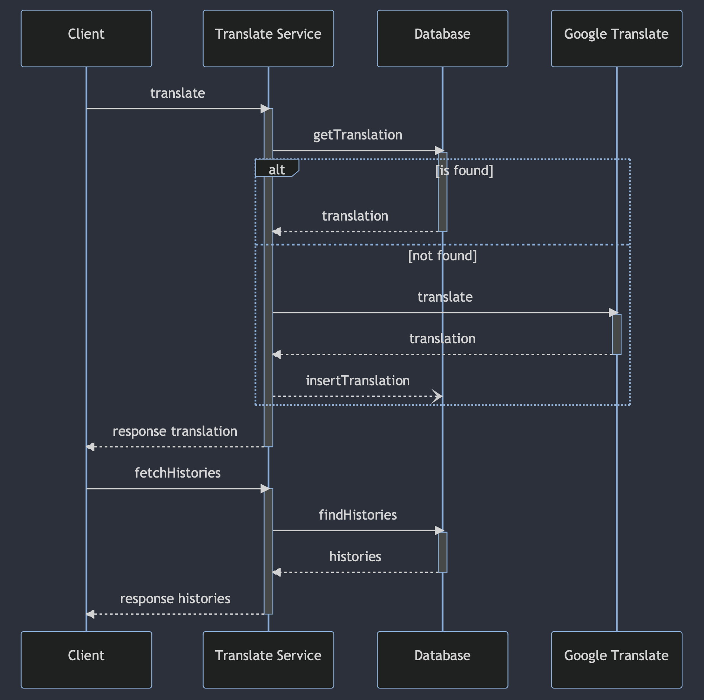

# Go Clean Translation

A demo repository for my explanation and implementing Clean Architecture in Golang.

## Diagrams

## Credits

I strongly recommend check this repo for further details https://github.com/evrone/go-clean-template